# Hybrid Endpoint Threat Detection Lab - Splunk SIEM

A hands-on SOC Analyst project focused on threat detection, investigation, and attack lifecycle analysis using Splunk Enterprise. This project demonstrates practical SIEM workflows across SSH authentication logs and Windows Security Event Logs, covering brute force attacks, password spraying, malicious PowerShell activity, privilege escalation, persistence mechanisms, lateral movement, RDP attacks, and defense evasion techniques.

The lab showcases SPL query development, threat hunting, dashboard creation, attack timeline reconstruction, and incident investigation aligned with real-world SOC operations.

---

# SSH Log Analysis

## 1. Analyze Failed Login Attempts

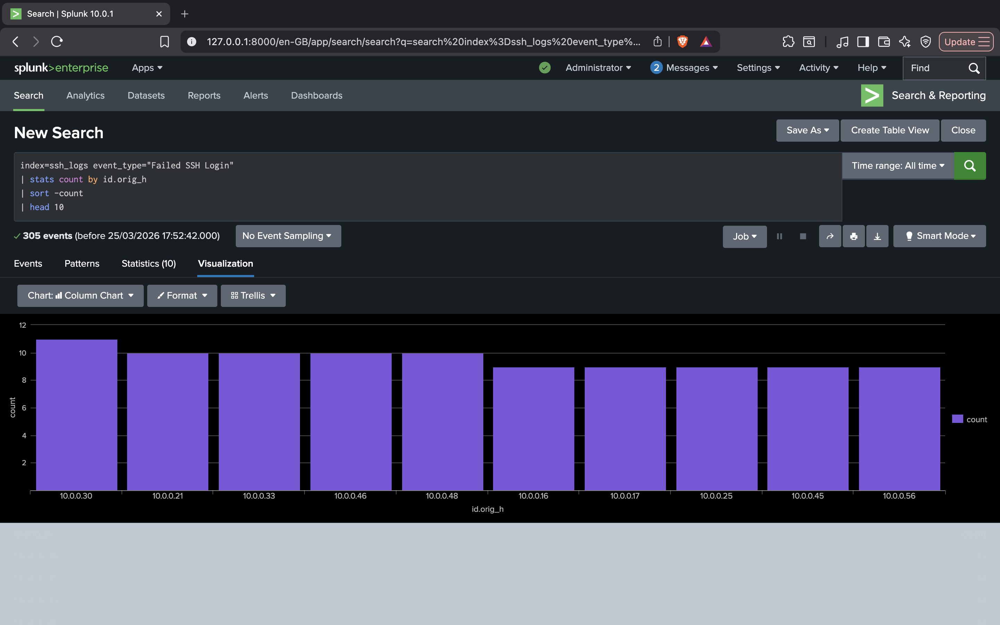

### Observation
Multiple failed SSH authentication attempts were identified from internal source IP addresses including 10.0.0.30, 10.0.0.31, 10.0.0.33, 10.0.0.45, 10.0.0.46, 10.0.0.47, 10.0.0.48, and 10.0.0.56. Several hosts generated repeated login failures.

### Analysis
Repeated failures from the same systems indicate potential brute-force activity or compromised hosts attempting lateral movement. The consistency of failures suggests automated credential guessing rather than normal user behavior.

### Conclusion
The environment shows indicators of suspicious SSH authentication activity consistent with brute-force attacks and requires continuous monitoring and alerting.

---

## 2. Detect Multiple Failed Authentication Attempts

### Observation
Several source IPs repeatedly attempted authentication within a short time period, generating high volumes of failed login events.

### Analysis
High-frequency failures are commonly associated with automated attack tools. The distribution across multiple systems suggests coordinated attack behavior.

### Conclusion
Authentication activity deviates significantly from normal patterns and aligns with brute-force or password spraying techniques.

---

## 3. Track Successful Logins

### Observation
Successful SSH login events were identified and correlated against previous failed authentication attempts.

### Analysis
A successful login following multiple failures may indicate a compromised account or successful credential guessing attack.

### Conclusion
Correlating successful and failed logins improves visibility into potential compromises and supports faster incident response.

---

## 4. Spot Suspicious Connections Without Authentication

### Observation
Persistent SSH connection attempts were observed without successful authentication.

### Analysis
Continuous connection activity suggests automated reconnaissance, credential testing, or brute-force behavior.

### Conclusion
The observed pattern reflects sustained attack activity that should be investigated and monitored closely.

---

# Windows Security Log Analysis

# Brute Force Attack

## Q1. Total Failed Logon Attempts (Event ID 4625)

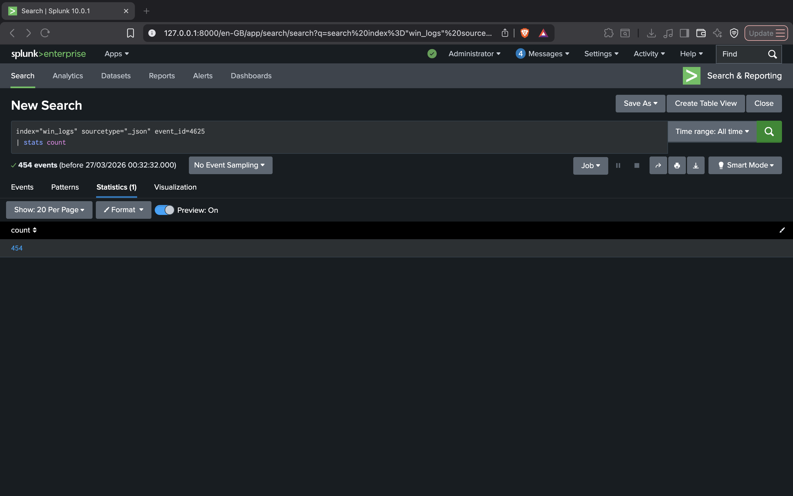

### Observation
Windows Security logs contain numerous Event ID 4625 entries generated across multiple users and systems.

### Analysis
Repeated failures against specific accounts indicate brute-force attempts, while failures across many users may suggest password spraying.

### Conclusion
The authentication activity is suspicious and consistent with credential-based attack behavior.

---

## Q2. Which Source IP Has the Highest Number of Failed Logons?

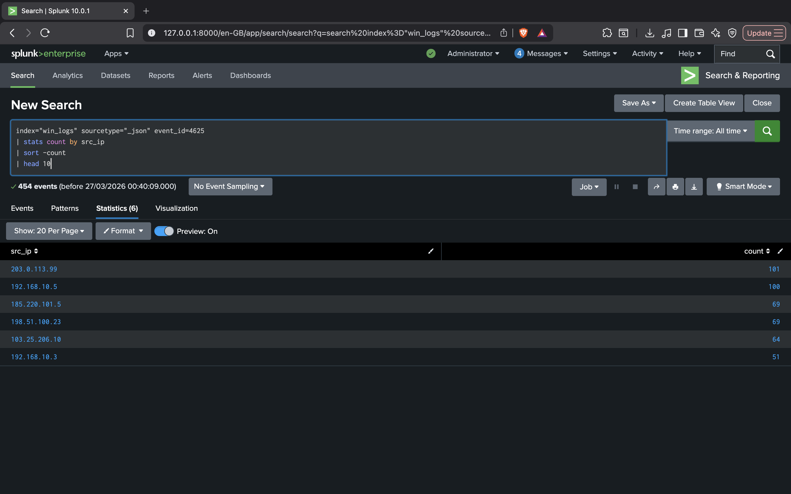

### Observation
Certain source IPs generated significantly higher numbers of failed login attempts compared to others.

### Analysis
A single source producing excessive failures is a strong indicator of brute-force activity.

### Conclusion
The identified source IP should be investigated immediately and correlated with other security events.

---

## Q3. After the Brute Force Attempts, Did the Attacker Successfully Log In?

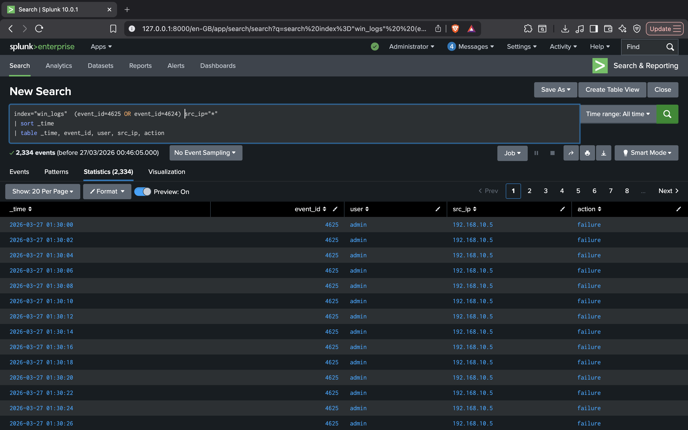

### Observation
Successful logon events occurred after a sequence of failed login attempts.

### Analysis
The sequence of Event ID 4625 followed by Event ID 4624 is commonly associated with successful credential compromise.

### Conclusion
The activity suggests a potential account compromise and requires immediate validation.

---

## Q4. Which Accounts Were Targeted Most by Brute Force?

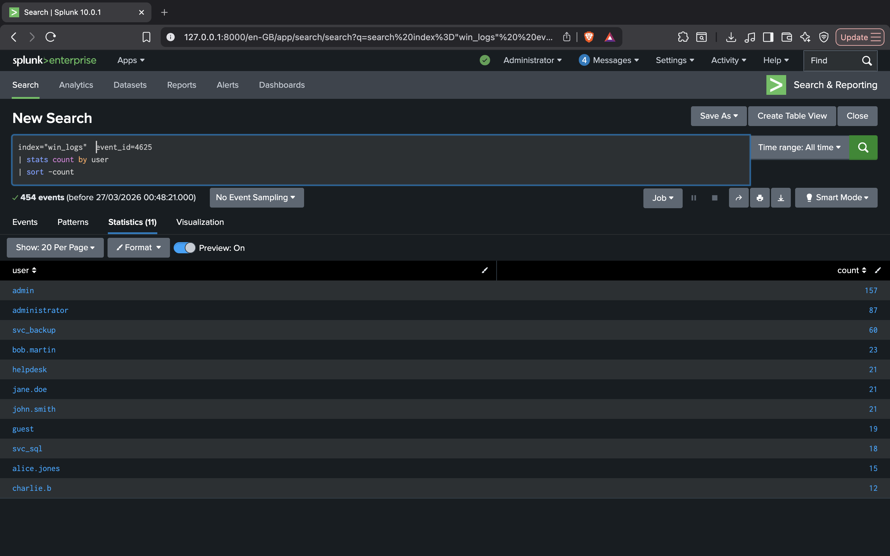

### Observation
Specific user accounts experienced significantly higher numbers of failed login attempts.

### Analysis
High-value accounts are commonly targeted during credential attacks.

### Conclusion
Targeted accounts should be protected through stronger authentication controls and monitoring.

---

## Q5. Were Any Accounts Locked Out as a Result?

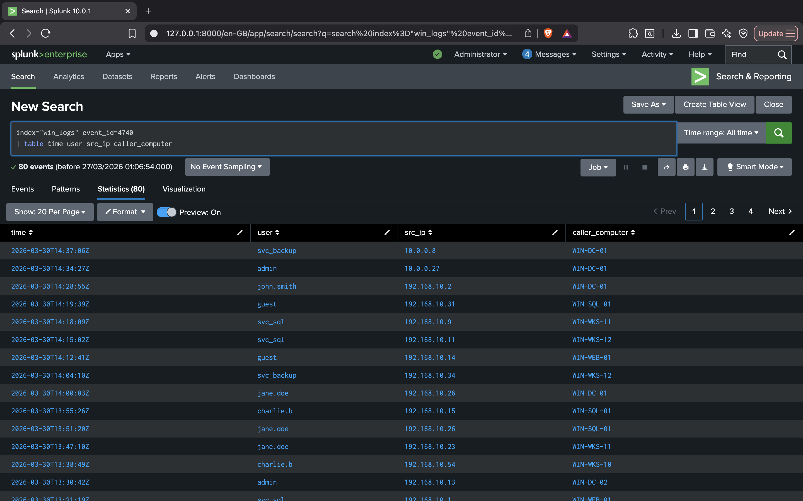

### Observation
Failed login attempts occurred continuously over time with noticeable spikes.

### Analysis
The activity pattern is consistent with automated brute-force attacks.

### Conclusion
Account lockout policies and alerting mechanisms are essential to reduce attack success rates.

---

# Password Spray

## Q6. Can You Identify a Password Spray Pattern in the Dataset?

### Observation
A single source IP attempted authentication against multiple user accounts while maintaining a low attempt count per account.

### Analysis
This behavior is characteristic of password spraying attacks designed to avoid lockout thresholds.

### Conclusion
The dataset contains clear indicators of password spraying activity.

---

## Q7. In the Spray Attack, What Time Window Did All Attempts Occur In?

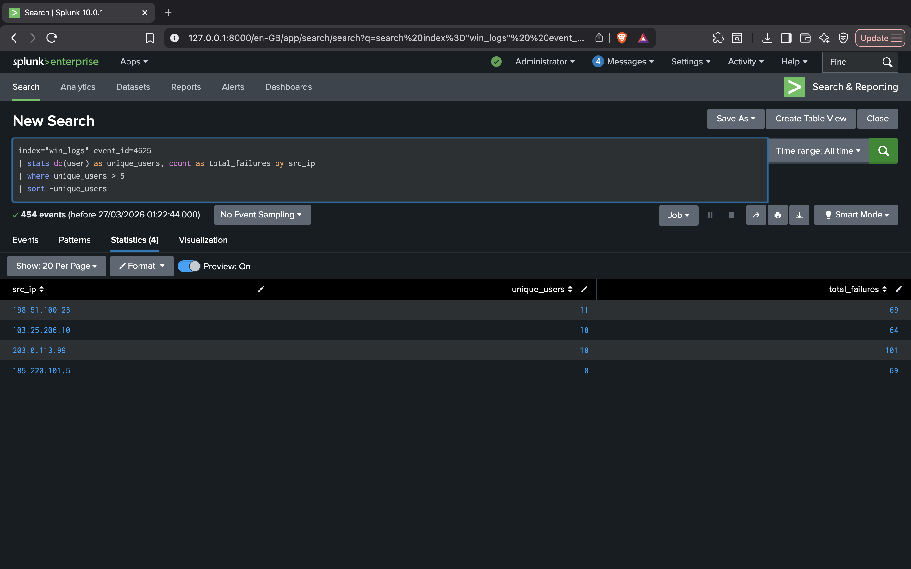

### Observation
Failed logins occurred within a tightly grouped time window across multiple user accounts.

### Analysis
Closely timed authentication attempts indicate deliberate and controlled attack execution.

### Conclusion
Time-based correlation is critical for identifying stealthy password spraying campaigns.

---

## Q8. How Do You Distinguish Brute Force from Password Spray Using Splunk?

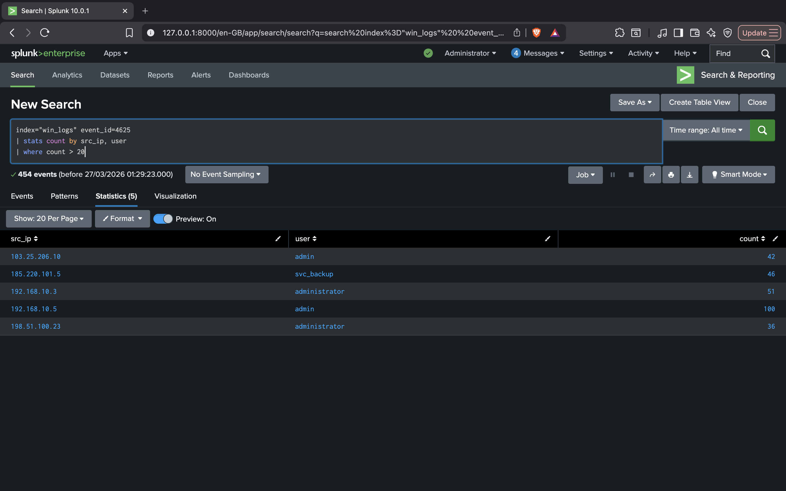

### Observation
Two distinct authentication patterns were identified within the dataset.

### Analysis
Brute force focuses on one user with many attempts, while password spraying targets many users with few attempts each.

### Conclusion
Behavior-based detection rules effectively differentiate between these attack techniques.

---

# Malicious Process Execution / LOLBins

## Q9. Suspicious PowerShell Execution

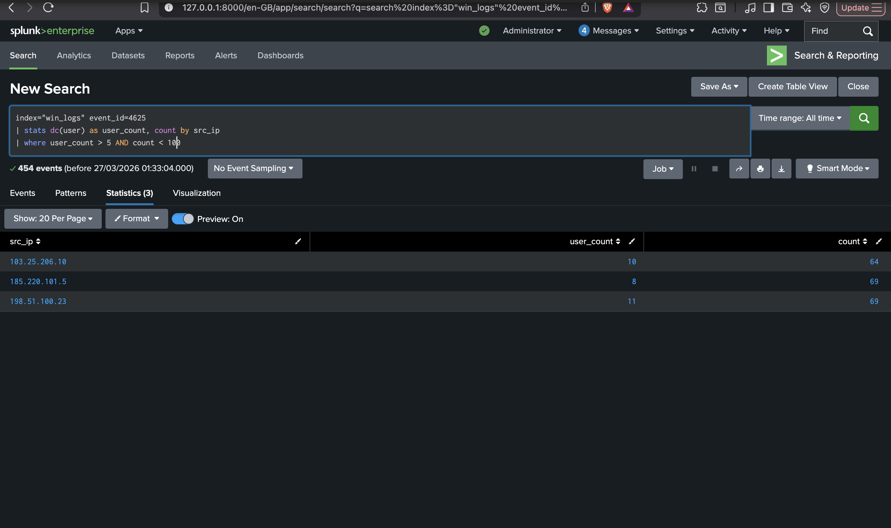

### Observation
Several PowerShell executions contained suspicious arguments including -enc, -nop, and -bypass.

### Analysis
These parameters are frequently used by attackers to evade detection and execute malicious payloads.

### Conclusion
The activity represents a high-confidence indicator of potentially malicious PowerShell usage.

---

## Q10. Encoded PowerShell Download Activity

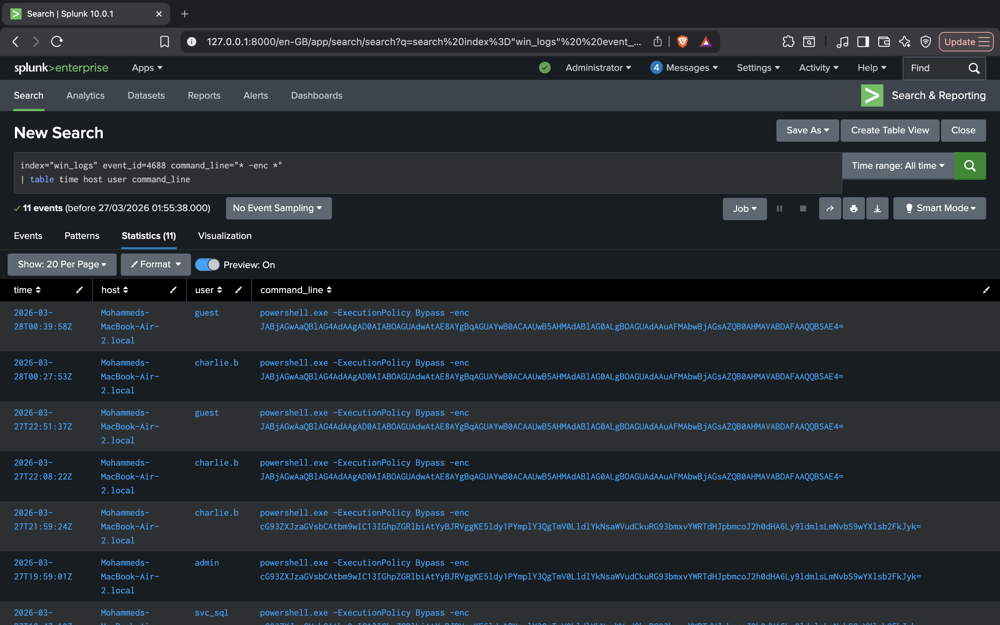

### Observation
Encoded PowerShell commands were identified within process creation logs.

### Analysis
Decoding the commands revealed download functionality commonly associated with malware delivery.

### Conclusion
The activity demonstrates post-compromise behavior requiring immediate investigation.

---

## Q11. LOLBin Abuse Detection

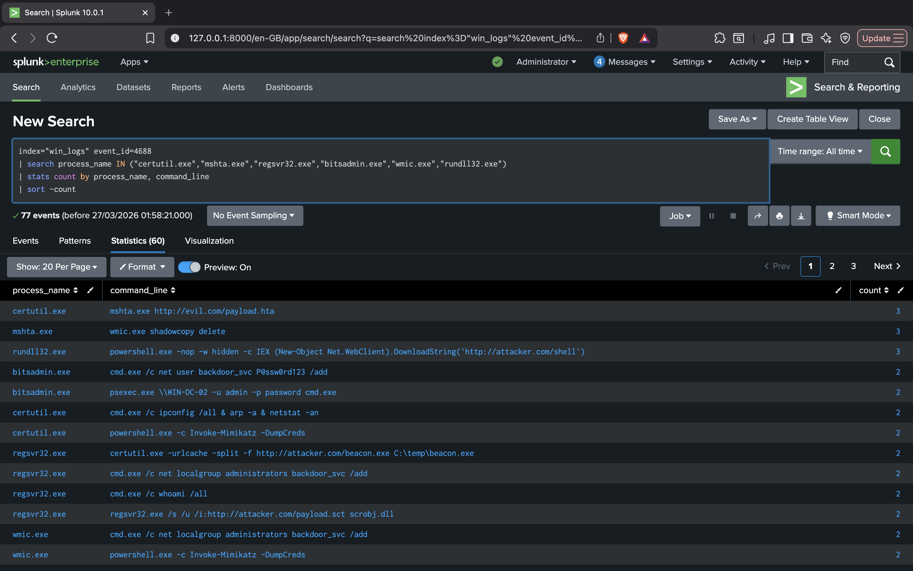

### Observation
Legitimate Windows binaries including PowerShell, CMD, Certutil, Bitsadmin, and MSHTA were observed.

### Analysis
Attackers frequently abuse trusted binaries to evade traditional security controls.

### Conclusion
LOLBin execution should be continuously monitored and correlated with network activity.

---

# Persistence – Account Creation & Admin Group Add

## Q12. Suspicious Account Creation

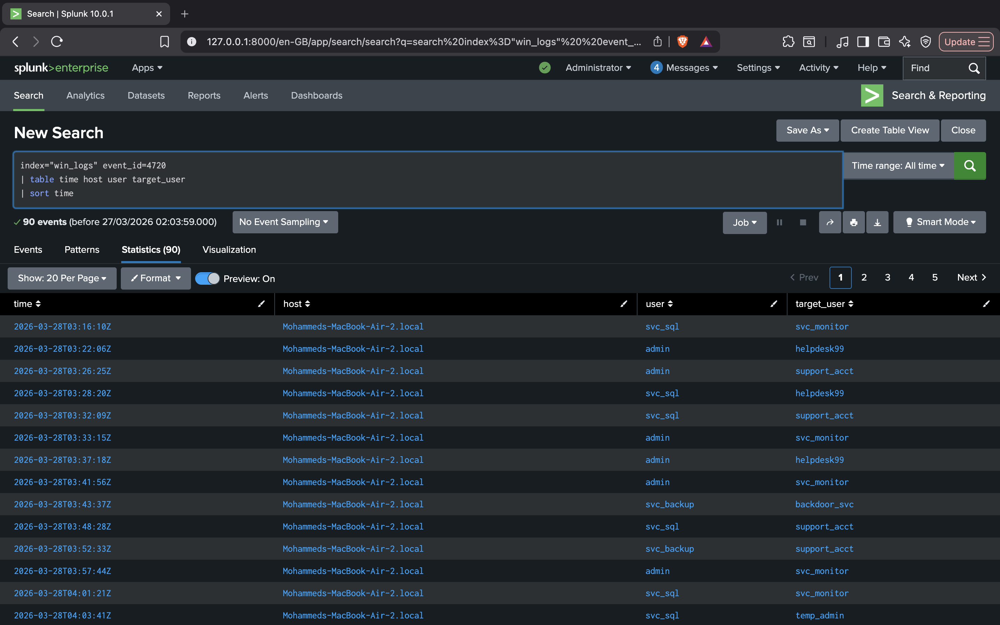

### Observation
New user accounts were created outside business hours and by unexpected accounts.

### Analysis
Unauthorized account creation is a common persistence technique used after compromise.

### Conclusion
The activity requires validation and continuous monitoring.

---

## Q13. Newly Created Accounts Added to Administrators Group

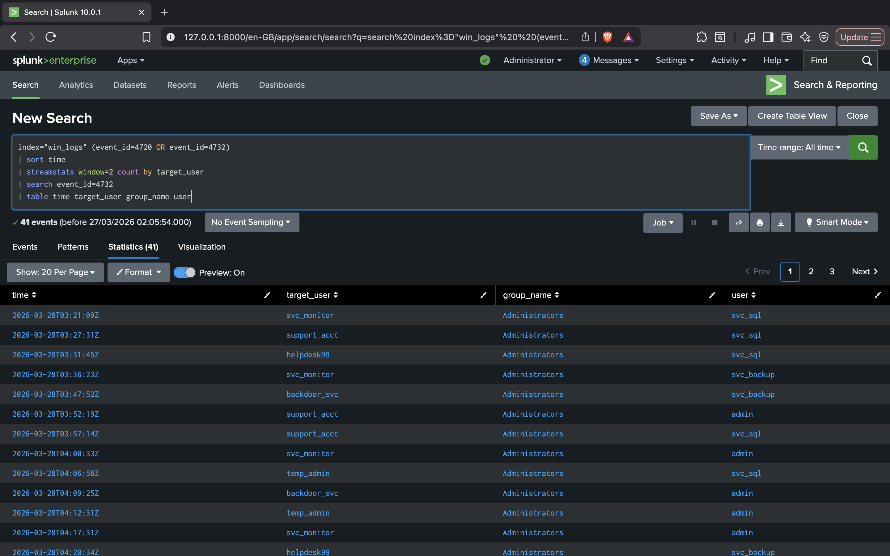

### Observation
Recently created accounts were added to privileged security groups.

### Analysis
Immediate privilege escalation following account creation is a strong indicator of malicious activity.

### Conclusion
The behavior represents a significant security risk requiring immediate investigation.

---

# Defense Evasion – Audit Log Clearing

## Q14. Audit Log Clearing Events

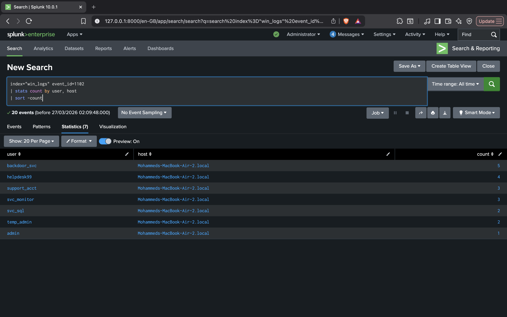

### Observation
Event ID 1102 entries indicate security audit log deletion activity.

### Analysis
Log clearing is a common defense evasion technique used to remove evidence of compromise.

### Conclusion
These events should be treated as high-severity security alerts.

---

## Q15. Attack Activity Before Log Clearing

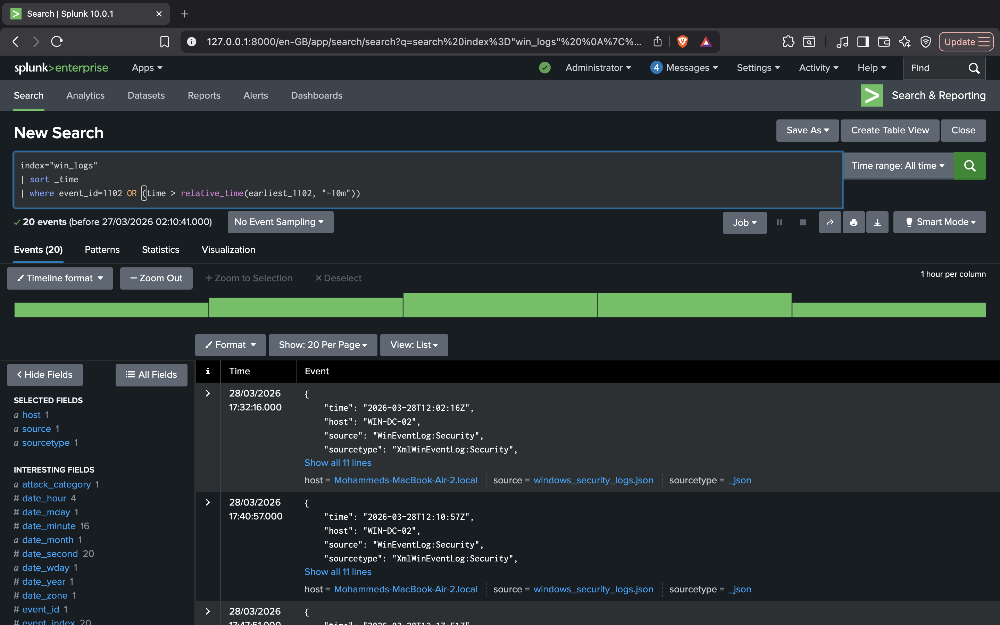

### Observation
Authentication failures, privilege escalation, and suspicious process executions occurred before log deletion.

### Analysis
The sequence suggests attackers attempted to conceal evidence after completing objectives.

### Conclusion
The activity strongly supports a compromise scenario.

---

# Lateral Movement

## Q16. Network Logons Across Multiple Hosts

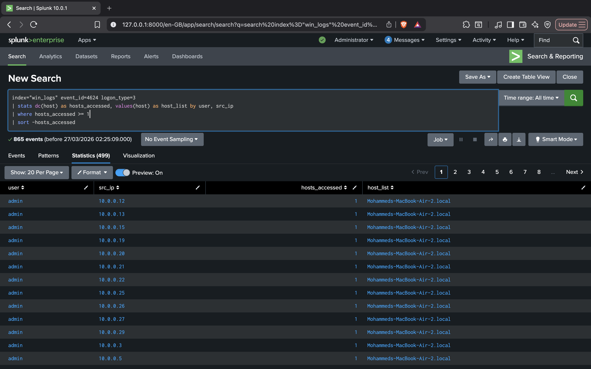

### Observation
Users performed Logon Type 3 authentications across multiple systems in short timeframes.

### Analysis
Rapid access to multiple hosts is often associated with lateral movement activity.

### Conclusion
The behavior warrants investigation for credential misuse.

---

## Q17. Explicit Credential Logons (Event ID 4648)

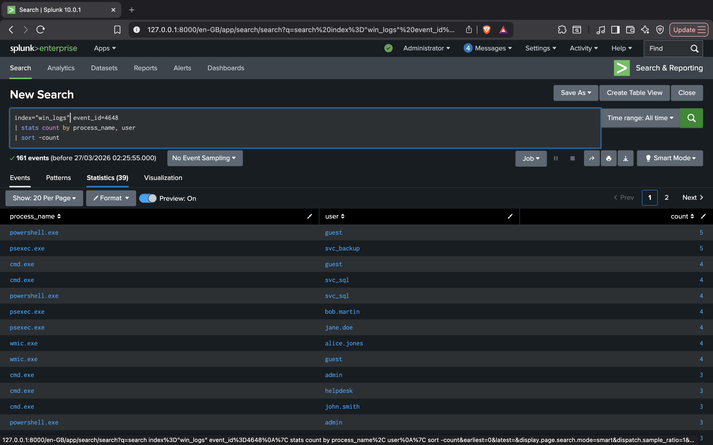

### Observation
Multiple explicit credential usage events were generated by command-line tools.

### Analysis
Event ID 4648 is frequently associated with administrative activity and attacker movement between systems.

### Conclusion
Credential usage patterns should be validated and monitored closely.

---

# RDP Brute Force

## Q18. Identify RDP Brute Force Attempts

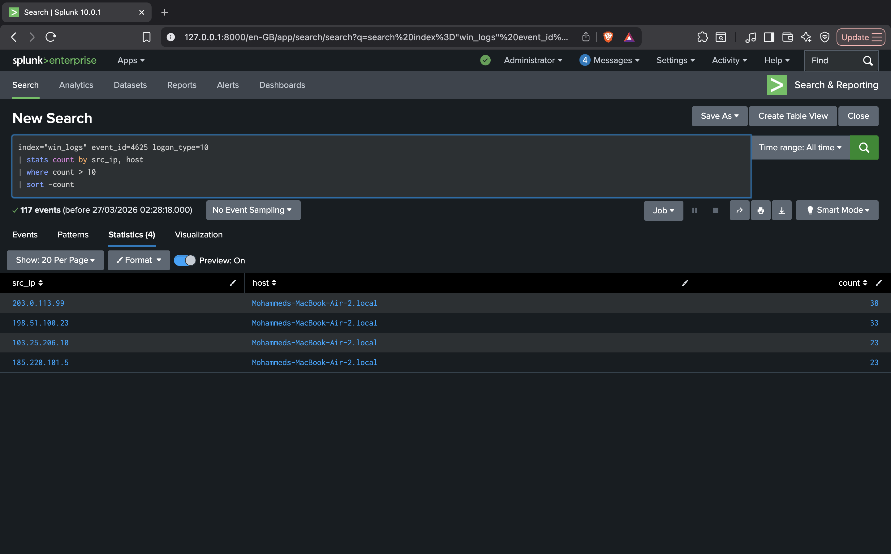

### Observation
Multiple Event ID 4625 failures with Logon Type 10 originated from a single source IP.

### Analysis
The pattern indicates an automated RDP brute-force attack.

### Conclusion
The source IP should be blocked and investigated immediately.

---

## Q19. Attack Timeline Reconstruction

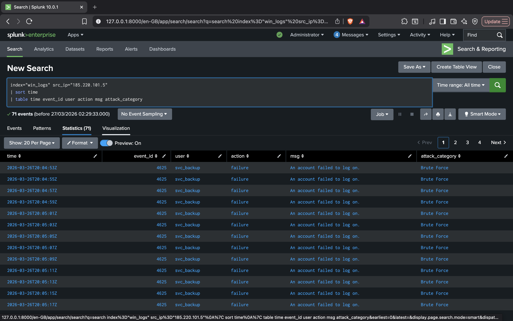

### Observation
Multiple security events reveal a complete attack lifecycle.

### Analysis
The attack progressed through Initial Access, Execution, Persistence, Lateral Movement, and Defense Evasion stages.

### Conclusion
The dataset demonstrates a realistic multi-stage compromise scenario.

---

# Privilege Escalation

## Q20. Dangerous Privilege Assignment

### Observation
Special privileges such as SeDebugPrivilege were assigned to user accounts.

### Analysis
These privileges provide elevated system access and may indicate privilege escalation attempts.

### Conclusion
The activity should be treated as a high-priority security event.

---

## Q21. Sensitive Group Membership Changes

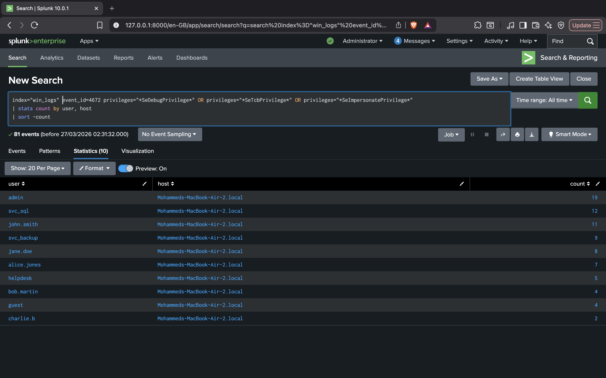

### Observation
Users were added to highly privileged security groups.

### Analysis
Privileged group modifications are critical security events commonly associated with unauthorized access.

### Conclusion
The event confirms elevated privilege assignment and requires investigation.

---

# Key Skills Demonstrated

- Splunk Enterprise Administration
- SIEM Monitoring and Alerting
- SPL Query Development
- SSH Authentication Log Analysis
- Windows Security Event Log Analysis
- Brute Force Detection
- Password Spray Detection
- PowerShell Threat Hunting
- LOLBin Investigation
- Privilege Escalation Detection
- Persistence Monitoring
- Lateral Movement Analysis
- RDP Attack Detection
- Defense Evasion Investigation
- Dashboard Development and Visualization
- Incident Investigation and Threat Hunting
- SOC Analyst Workflows
- MITRE ATT&CK Aligned Detection Techniques

---

**Author:** Mohammed Wajihuddin
