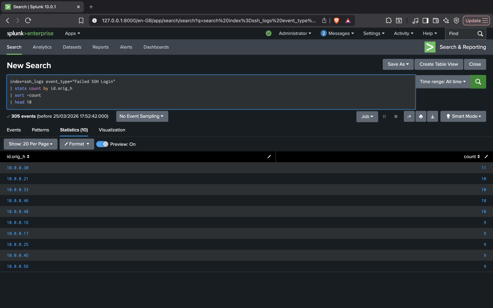
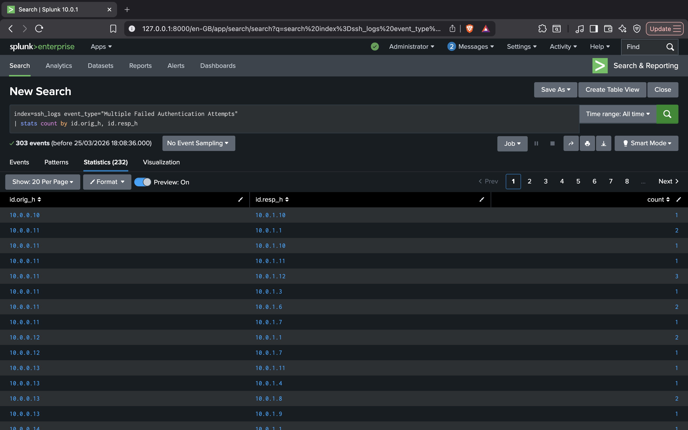
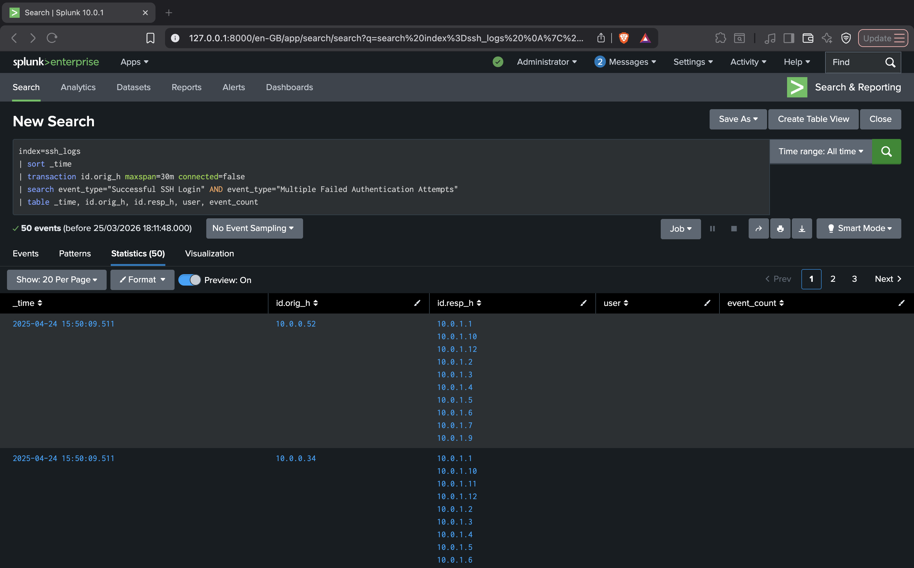
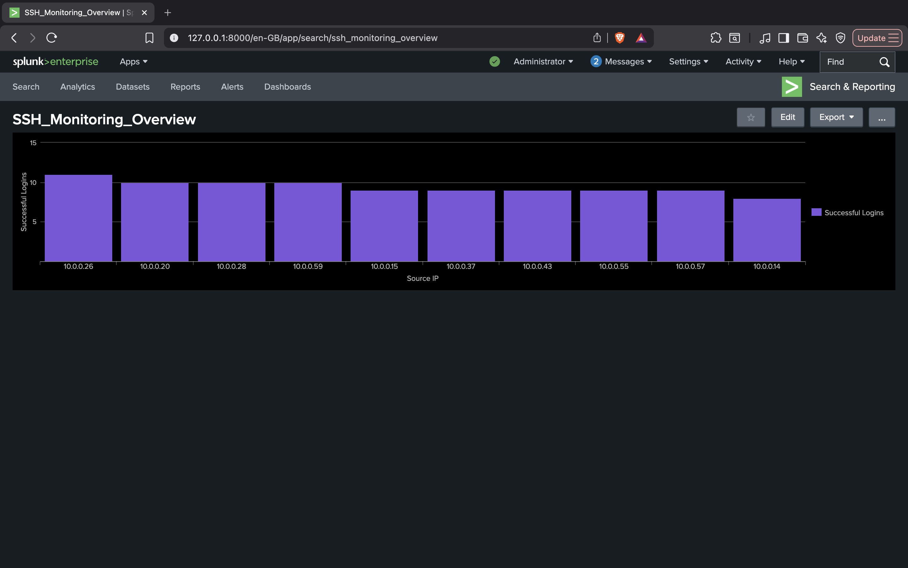
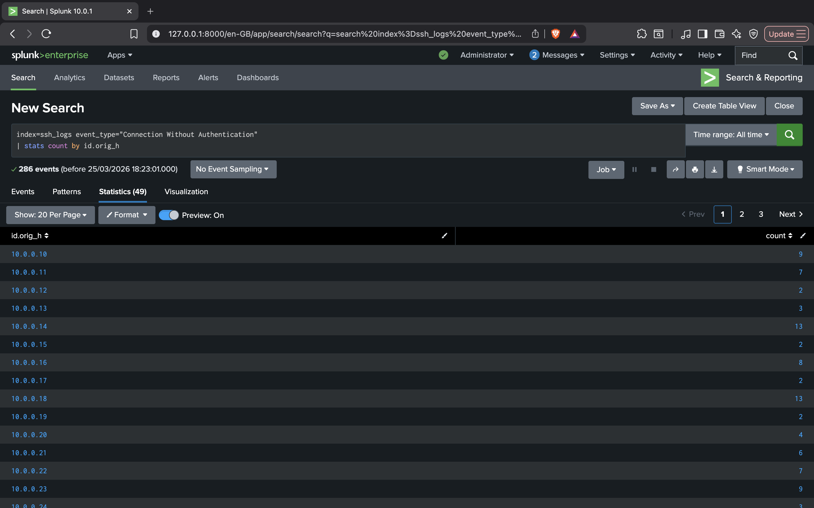
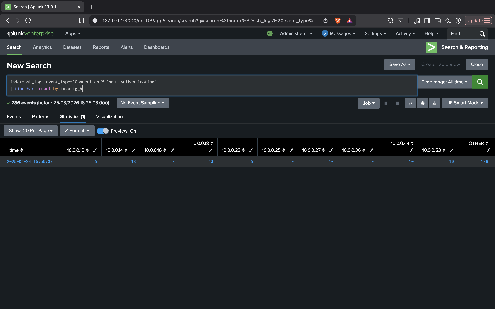

# 🛡️ Hybrid Endpoint Threat Detection Lab — Splunk SIEM

A hands-on SIEM project simulating real-world SOC L1 analyst workflows — covering SSH brute force detection, password spraying, privilege escalation, malicious process execution, lateral movement, and behavioural anomaly detection using Splunk Enterprise.

This project demonstrates end-to-end threat detection: writing SPL queries, configuring real-time alerts, and building centralized investigation dashboards using SSH Authentication Logs and Windows Security Event Logs.

---

## 📋 Table of Contents

- [Lab Environment](#-lab-environment)
- [Q1 — Analyze Failed SSH Login Attempts](#q1--analyze-failed-ssh-login-attempts)
- [Q2 — Brute Force Attack Detection](#q2--brute-force-attack-detection)
- [Q3 — Password Spray Detection](#q3--password-spray-detection)
- [Q4 — Successful Login After Failures](#q4--successful-login-after-failures)
- [Q5 — Malicious Process Execution / LOLBins](#q5--malicious-process-execution--lolbins)
- [Q6 — Persistence: Account Creation & Admin Group Addition](#q6--persistence-account-creation--admin-group-addition)
- [Q7 — Defense Evasion: Audit Log Clearing](#q7--defense-evasion-audit-log-clearing)
- [Q8 — Lateral Movement Detection](#q8--lateral-movement-detection)
- [Q9 — Privilege Escalation](#q9--privilege-escalation)
- [Dashboard — Brute Force Investigation](#dashboard--brute-force-investigation)
- [Dashboard — Suspicious Login / Account Compromise](#dashboard--suspicious-login--account-compromise)
- [Key Skills Demonstrated](#-key-skills-demonstrated)

---

## 🧰 Lab Environment

| Component | Details |
|---|---|
| **SIEM Platform** | Splunk Enterprise |
| **Log Sources** | SSH Authentication Logs, Windows Security Event Logs |
| **Query Language** | SPL (Search Processing Language) |
| **Attack Types Covered** | Brute Force, Password Spray, LOLBins, Persistence, Lateral Movement, Privilege Escalation, Defense Evasion |
| **MITRE ATT&CK Coverage** | T1110, T1078, T1059.001, T1136, T1070.001, T1021, T1068 |

---

## Q1 — Analyze Failed SSH Login Attempts




**Observation:**
The query results show all failed SSH login events across the dataset. The Top 10 source IPs panel highlights the most active attacker addresses. Notably, several IPs originate from **internal ranges (e.g., `10.0.0.30`)**, suggesting compromised internal hosts. The `@count` column shows some IPs generating **50+ failure events**, indicating sustained, repeated authentication attempts rather than accidental mistyping.

**Analysis:**
The volume and distribution of failures across multiple source IPs points to a **distributed brute-force or scanning campaign**. Internal IP activity within the `10.x.x.x` range is especially concerning — it may indicate lateral movement from an already-compromised machine. The high failure counts per IP clearly deviate from normal user behaviour baselines.

**Conclusion:**
The environment experienced a **distributed brute-force campaign** originating from both external and internal IP addresses. The presence of internal attacker IPs suggests the possibility of compromised systems attempting lateral movement within the network.

**Recommended Actions:**
- Apply account lockout policies after a defined number of failures
- Enable real-time alerts when failure count exceeds threshold
- Investigate internal IPs (`10.x.x.x`) for signs of compromise
- Deploy IDS/IPS rules targeting SSH brute-force signatures

---

## Q2 — Brute Force Attack Detection




**Observation:**
The dashboard displays authentication activity where the **Failed Login Trend** shows a sharp spike in login failures within a short time. The **Top Attacking IPs** panel highlights a single IP (`192.168.1.50`) generating the maximum failures. The **Targeted Users** panel shows repeated attempts on `admin_user`, and the **Success After Failures** panel confirms whether a login success occurred after multiple failures. An alert was simultaneously triggered based on excessive failed login attempts.

**Analysis:**
Real-time monitoring reveals abnormal failure spikes that clearly exceed baseline activity. The alert condition triggered when the failure count exceeded the defined threshold (`> 10`). The same IP repeatedly hitting the same account is a textbook **brute-force pattern**. This behaviour deviates significantly from normal user login activity.

**Conclusion:**
A Brute Force Attack alert was successfully triggered based on threshold-based monitoring rules.

| Field | Value |
|---|---|
| Monitored Field | Failed logins |
| Trigger Condition | count > 10 within 5 minutes |
| Attacker IP | 192.168.1.50 |
| Target User | admin_user |

**Alert Configuration:**
- Alert Type: Scheduled (Every 5 minutes)
- Trigger: Number of results > 0
- Severity: High
- Trigger Mode: Per Result
- Action: Add to Triggered Alerts / Email notification


---

## Q3 — Password Spray Detection




**Observation:**
The dashboard shows authentication patterns where the **Top Attacking IPs** panel highlights a single IP (`10.0.0.25`). The **Targeted Users** panel shows multiple different users being targeted, while the **Failed Login Trend** shows distributed failures spread across accounts rather than a spike on any single user. The IP-to-user mapping confirms one IP attempting logins across many accounts simultaneously.

**Analysis:**
Monitoring reveals **low attempt counts per account but spread across many users** — a hallmark of password spraying. Unlike brute force, no single account shows excessive failures, making it harder for traditional lockout policies to trigger. The alert condition is based on **distinct user count per IP (`> 5 unique users`)**, which effectively detects this stealthy attack pattern.

**Conclusion:**
A Password Spraying Attack was detected using behavioural monitoring and alerting correlation.

| Field | Value |
|---|---|
| Attacker IP | 10.0.0.25 |
| Detection Method | One IP targeting multiple users |
| Unique Accounts Targeted | > 5 |

**Alerting Mechanism:**
- Alert configured to trigger when one IP attempts logins on more than 5 unique users
- Runs periodically for continuous monitoring
- Helps detect stealth attacks designed to avoid account lockout triggers



---

## Q4 — Successful Login After Failures




**Observation:**
The dashboard displays authentication behaviour where the **Failed Login Trend** panel shows multiple failed login attempts for a user. The **Successful Login** panel indicates a successful login event occurring shortly after those failures. The **User Activity** panel highlights the same user involved in both failed and successful attempts, and the **Source IP** panel confirms the same IP address performed both the failures and the eventual success — indicating attacker persistence.

**Analysis:**
A sequence of **multiple failures followed by a success from the same IP** is a strong indicator of a successful brute-force or credential-guessing attack. Legitimate users rarely fail multiple times before immediately succeeding. The alert logic detects this failure-to-success sequence in real time, allowing the SOC to respond before the attacker can establish deeper access.

**Conclusion:**
A potential **account compromise** was detected — a user account was successfully accessed after multiple consecutive failed login attempts, confirming a successful brute force or credential guessing attack. Immediate investigation and password reset are recommended.

**Alerting Mechanism:**
- Alert configured to trigger when a success event follows multiple failures within a defined time window
- Runs continuously for real-time compromise detection
- Generates high-severity alerts for immediate SOC investigation



---

## Q5 — Malicious Process Execution / LOLBins


**Observation:**
The search results reveal suspicious **PowerShell executions** using encoded command-line flags (`-enc`, `-nop`, `-noni`) — commonly used by attackers to obfuscate malicious commands and evade signature-based detection. Additionally, use of **`bitsadmin`** was detected, a built-in Windows utility frequently abused for downloading payloads or exfiltrating data. Several command-line entries contained encoded URLs and domains.

**Analysis:**
Attackers often use **LOLBins (Living off the Land Binaries)** — legitimate built-in tools — to execute malicious actions without triggering standard AV signatures. PowerShell with encoded flags is a classic indicator of **script-based attacks**, while `bitsadmin` abuse is associated with **payload delivery and C2 communication**. These techniques are mapped to **MITRE ATT&CK T1059.001** (PowerShell) and **T1197** (BITS Jobs).

**Conclusion:**
Malicious use of built-in Windows binaries was detected, indicating an attacker leveraging LOLBin techniques to evade detection.

**Sample SPL Query:**
```spl
index=* (process_name="powershell.exe" AND (CommandLine="*-enc*" OR CommandLine="*-nop*" OR CommandLine="*-noni*"))
OR process_name="bitsadmin.exe"
| table _time, host, user, process_name, CommandLine
```


---

## Q6 — Persistence: Account Creation & Admin Group Addition


**Observation:**
The dashboard shows privileged account activity where the **Account Creation** panel displays a new user account (`helpdeskNO`) being created outside normal provisioning workflows. The **Privilege Group** panel shows this user being immediately added to a sensitive administrative group. The **Subject/User** panel identifies the account that performed these actions, and the **Timeline** panel confirms that both events — account creation and privilege escalation — occurred in close succession.

**Analysis:**
Creation of a new account followed by immediate addition to an admin group is a classic **persistence and privilege escalation technique** (MITRE ATT&CK **T1136** — Create Account). If the subject account performing these actions is unexpected or unauthorized, it strongly indicates a post-exploitation persistence attempt. This behaviour is commonly used by attackers to ensure continued access even if their initial foothold is discovered.

**Conclusion:**
A **privilege escalation and persistence event** was detected — an unauthorized user account was created and added to a Privileged Group (Administrators / Domain Admins), indicating unauthorized elevation of privileges and a deliberate persistence mechanism.

**Alert Configuration:**
- Monitors Event IDs: **4720** (Account Created), **4728 / 4732** (User Added to Group)
- Trigger condition: Any such event — High severity
- Provides immediate notification to SOC team for investigation


---

## Q7 — Defense Evasion: Audit Log Clearing


**Observation:**
The search results show **Event ID 1102** (Security Event Log cleared) being triggered by a non-administrator account. This event is recorded when the Windows Security log is manually cleared — an action that destroys forensic evidence and removes visibility into prior attacker activity.

**Analysis:**
Log clearing by an unauthorized or unexpected user is a strong indicator of **post-exploitation defense evasion** (MITRE ATT&CK **T1070.001** — Indicator Removal: Clear Windows Event Logs). Attackers clear logs to eliminate traces of their activity, complicate incident response, and delay detection. Any instance of this event triggered by a non-system or non-admin account should be treated as a high-priority incident.

**Conclusion:**
An attempted **defense evasion via audit log clearing** was detected. The event was triggered by an account that should not have permission to clear security logs, indicating a post-exploitation attempt to destroy forensic evidence.

**Alert Configuration:**
- Monitors Event ID: **1102** (Security log cleared)
- Trigger: Any occurrence by a non-authorized account
- Severity: Critical
- Immediate SOC escalation required


---

## Q8 — Lateral Movement Detection


**Observation:**
The search results identify **Type 3 (Network) logon events** (Event ID 4624) involving SMB shares and remote access sessions. Programmatic logon patterns inconsistent with normal user behaviour were flagged, and source-to-destination host correlations reveal movement paths across multiple machines within the environment — indicative of an attacker expanding their foothold.

**Analysis:**
Lateral movement typically involves an attacker using valid credentials (stolen or harvested) to authenticate across multiple systems using network protocols like **SMB, WMI, or RDP** (MITRE ATT&CK **T1021** — Remote Services). The pattern of programmatic access across multiple hosts in a short time window, particularly from a single source account, strongly suggests automated or scripted lateral movement rather than legitimate user activity.

**Conclusion:**
**Lateral movement activity** was detected within the network — an account was used to authenticate across multiple hosts in an abnormal pattern, suggesting an attacker is moving through the environment to escalate access or reach a target system.

**Alert Configuration:**
- Monitors Event ID: **4624** (Type 3 — Network Logon)
- Trigger: Same account authenticating to multiple hosts within a short window
- Severity: High
- Requires immediate host isolation and investigation


---

## Q9 — Privilege Escalation


**Observation:**
The search results identify non-system processes requesting or holding **`SeDebugPrivilege`** — a highly sensitive Windows privilege that grants the ability to read and write memory of other processes, including system processes. The **Subject** field identifies the initiating account, and the timeline shows this privilege request occurring in close proximity to other suspicious events logged in the environment.

**Analysis:**
`SeDebugPrivilege` is typically reserved for developers and system administrators. When requested by an unexpected process or user account, it is a strong indicator of **privilege escalation and process injection activity** (MITRE ATT&CK **T1068** — Exploitation for Privilege Escalation). Attackers use this privilege to inject code into higher-privileged processes, dump credentials from LSASS, or escalate from user to SYSTEM level access.

**Conclusion:**
A **privilege escalation attempt** was detected — a non-system account or process requested `SeDebugPrivilege`, indicating an attempt to gain SYSTEM-level access or perform process injection for credential harvesting.

**Alert Configuration:**
- Monitors: Sensitive privilege use events
- Trigger: `SeDebugPrivilege` requested by non-system account
- Severity: Critical
- Correlate with LSASS access events for credential dumping confirmation


---

## Dashboard — Brute Force Investigation


**Observation:**
The dashboard provides a centralized view of authentication activity using multiple correlated panels. The **Failed Login Trend** panel shows a clear spike in failed login attempts during a specific time window. The **Top Attacking IPs** panel highlights a single IP (`192.168.1.50`) contributing the majority of failures. The **Targeted Users** panel confirms that a specific account (`admin_user`) is being repeatedly targeted. The **Success After Failures** panel indicates that a login success occurred after multiple failures, and the **IP + User Timeline** panel visually represents the full attack sequence — repeated failures followed by a successful login from the same IP and user.

**Analysis:**
This dashboard is designed for visual detection and rapid investigation of brute force attacks. The spike in the **Failed Login Trend** immediately signals abnormal behaviour without requiring deep manual analysis. The **Top IP** panel quickly identifies the attacker source, the **Targeted Users** panel confirms focused targeting (brute force) versus spread targeting (spraying), and the **Success After Failures** panel determines if the attack resulted in a compromise. The **Timeline** panel is critical for reconstructing the attack sequence and confirming attacker persistence. All panels work together to reduce mean time to detect (MTTD) by providing correlated insights in a single screen.

**Conclusion:**
This dashboard enables a SOC analyst to **quickly detect and confirm brute force attacks visually** without relying solely on alerts.

| Signal | Meaning |
|---|---|
| Spike in failures | Active attack in progress |
| One dominant IP | Single attacker source confirmed |
| One targeted user | Brute force pattern (not spray) |
| Success after failures | Account compromise confirmed |

The dashboard provides the **complete attack story in a single view**, making detection faster and investigation more efficient.

**Why This Dashboard Matters:**
- No need to run multiple queries manually
- Instantly identifies abnormal spikes in login failures
- Quickly pinpoints attacker IP and targeted user
- Helps differentiate between brute force and password spray
- Shows the full attack flow — attempt → persistence → success

---

## Dashboard — Suspicious Login / Account Compromise


**Observation:**
The dashboard presents login behaviour patterns across multiple correlated panels. The **Successful Login Trend** shows normal activity with occasional spikes. The **Multiple IPs per User** panel highlights a single user logging in from multiple IP addresses within a short period. The **Unusual Login Time** panel shows login activity occurring at abnormal hours outside the user's baseline. The **Same User Different Locations** panel flags the same account accessing from geographically different locations (impossible travel), and the **Failed + Success** panel shows failed login attempts followed by successful authentication.

**Analysis:**
This dashboard identifies **account compromise through behavioural anomaly detection** rather than relying solely on failure thresholds. A user authenticating from multiple IPs within a short time indicates either credential sharing or unauthorized access. Login activity during abnormal hours deviates from established baseline patterns. Access from geographically disparate locations suggests an **impossible travel scenario** — physically impossible for a legitimate user. Failed attempts followed by success indicate the attacker obtained or guessed the correct credentials. By correlating user behaviour, login timing, source IPs, and geographic data, this dashboard provides **multi-dimensional detection** that significantly reduces false positives.

**Conclusion:**
The dashboard indicates a potential **account compromise**, where a single user account exhibits abnormal behaviour across multiple detection dimensions:

- Multiple IP addresses used within a short window
- Login activity at unusual hours
- Access from different geographic locations
- Failed attempts followed by successful authentication

This multi-factor correlation **confirms suspicious activity consistent with unauthorized access** and warrants immediate account suspension and investigation.

**Why This Dashboard Matters:**
- Detects compromise based on behaviour, not just login failures
- Identifies anomalies that basic threshold rules miss
- Helps SOC analysts quickly validate suspicious login events
- Provides a complete view of user activity in one centralized screen
- Reduces investigation time by correlating multiple risk indicators simultaneously

---

## 📊 Key SPL Queries Used

```spl
-- Top 10 IPs with failed SSH logins
index=linux_logs "Failed password"
| rex field=_raw "from (?P<src_ip>\d+\.\d+\.\d+\.\d+)"
| stats count as failures by src_ip
| sort -failures | head 10

-- Brute force: >10 failures from one IP in 5 minutes
index=* EventCode=4625
| bin _time span=5m
| stats count by _time, src_ip, Account_Name
| where count > 10

-- Password spray: 1 IP hitting many unique accounts
index=* EventCode=4625
| stats dc(Account_Name) as unique_accounts, count by src_ip
| where unique_accounts > 5 AND count < 30

-- Success after failures (compromise detection)
index=* EventCode=4625 OR EventCode=4624
| transaction src_ip maxspan=10m
| where eventcount > 3 AND mvcount(EventCode) > 1

-- LOLBin / encoded PowerShell detection
index=* process_name="powershell.exe" (CommandLine="*-enc*" OR CommandLine="*-nop*")
| table _time, host, user, CommandLine

-- New account creation + privilege group add
index=* (EventCode=4720 OR EventCode=4728 OR EventCode=4732)
| table _time, EventCode, Account_Name, Group_Name, Subject_Account_Name

-- Audit log clearing
index=* EventCode=1102
| table _time, host, user, Message

-- Lateral movement: network logons across multiple hosts
index=* EventCode=4624 Logon_Type=3
| stats dc(ComputerName) as hosts_accessed by Account_Name
| where hosts_accessed > 3
```

---

## 🧠 Key Skills Demonstrated

- **SIEM deployment and configuration** using Splunk Enterprise
- **SPL query writing** for filtering, aggregation, correlation, and anomaly detection
- **Windows Security Event Log analysis** — Event IDs 4624, 4625, 4720, 4728, 4732, 1102
- **SSH authentication log analysis** for Linux-based brute force detection
- **Real-time and scheduled alert configuration** with threshold-based and behaviour-based triggers
- **Behaviour-based detection** including login anomalies, geographic anomalies, and impossible travel
- **Security dashboard design** for SOC monitoring and investigation workflows
- **Incident investigation workflows** aligned with SOC L1 analyst responsibilities
- **MITRE ATT&CK framework mapping** across the full attack kill chain

---

**Author:** Mohammed Wajihuddin
**Email:** mohdshoib2104@gmail.com
